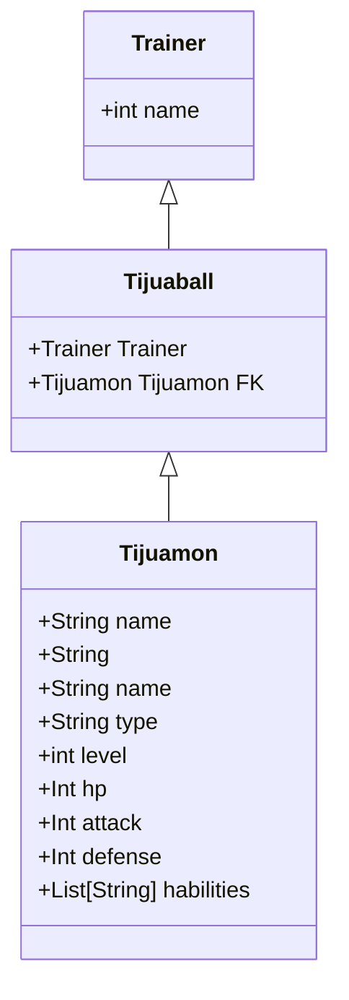

# 🐲 Tijuamón API

API REST educativa en **Python + Flask** para gestionar criaturas ficticias llamadas **Tijuamones**, inspiradas en Tijuana.

## 🚀 Objetivos
- Practicar desarrollo Backend con Python.
- Implementar CRUD con Flask.
- Conectar colecciones en memoria y luego migrar a SQLite.
- Enseñar colaboración en GitHub (commits, ramas, PRs).

## ⚙️ Instalación
```bash
git clone https://github.com/<usuario>/tijuamon-api.git
cd tijuamon-api
python3 -m venv .venv # or py -3 -m venv .venv
source .venv/bin/activate  # Windows: .venv\Scripts\activate
pip install -r requirements.txt
python app.py
```

## Entidades
Entidad principal: Tijuamon
Attributos minimos:
- id (int, autoincremental)
- nombre (str, único)
- tipo (str; p. ej., “fuego”, “agua”, “eléctrico”, “planta”, “normal”)
- nivel (int 1–100)
- hp (int > 0)
- ataque (int ≥ 0)
- defensa (int ≥ 0)


habilidades (lista de strings; opcional en MVP, puede empezar como string separada por comas)
## 📡 Endpoints
- ``POST /tijuamones`` → Crear Tijuamón
- ``GET /tijuamones`` → Listar Tijuamones
    - ``?tipo=agua ?nombre=pi (contiene) ?min_nivel=30``
- ``GET /tijuamones/<id>`` → Consultar uno
- ``PUT /tijuamones/<id>`` → Actualizar
- ``DELETE /tijuamones/<id>`` → Eliminar
- ``(Opcional) POST /batalla`` → Simular batalla
- ``(Opcional) GET /estadisticas`` → Estadísticas

## 👥 Equipo
Proyecto guía desarrollado por el profesor Ricardo Pérez Torres para la materia Backend I (CESUN).

## Diagrama de clases


